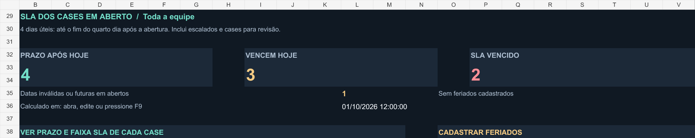
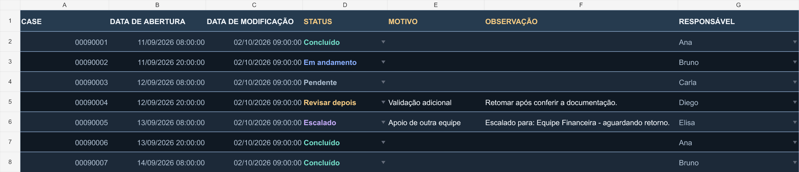

<div align="center">

# Tracking de Cases

**Distribuição equilibrada, acompanhamento em Excel, controle de SLA e relatórios.**

Ferramenta local desenvolvida em Python para organizar uma base de cases, distribuir o trabalho entre responsáveis e gerar uma tracking com dashboard gerencial, SLA de **4 dias úteis** e relatórios.


</div>

---


> Demonstração utilizando dados inteiramente fictícios.

## Documentação da versão 3.1

- [Guia de uso em Word](docs/Guia_Tracking_Cases.docx)
- [Apresentação do projeto](docs/Apresentacao_Tracking_Cases.pptx)
- [Regra e consulta do SLA](docs/SLA.md)
- [Teste com dados fictícios](exemplos/COMO_TESTAR.md)

## Sobre o projeto

O **Tracking de Cases** foi desenvolvido para facilitar a distribuição e o acompanhamento diário de demandas operacionais.

A ferramenta recebe uma base em Excel, valida os campos necessários, organiza os cases pela data de abertura e realiza uma distribuição equilibrada entre os responsáveis cadastrados.

Ao final, é gerada uma nova planilha contendo:

- tracking operacional;
- responsáveis por case;
- controle de status;
- motivos e observações;
- acompanhamento de escalonamentos;
- dashboard gerencial;
- indicadores por responsável;
- alertas de preenchimento;
- controle de SLA e cadastro de feriados;
- geração de resumo em PDF.

A aplicação funciona localmente e não depende de integrações externas para realizar a distribuição.

---

## Fluxo

```text
Base .xlsx
    ↓
Validação dos dados
    ↓
Cases em espera
    ↓
Ordenação por abertura
    ↓
Distribuição equilibrada
    ↓
Tracking .xlsm
    ↓
Dashboard do gestor
    ↓
Controle de SLA e detalhamento por case
    ↓
Resumo em PDF
```

---

## Principais funcionalidades

### Distribuição automática

Os cases são ordenados pela data e hora de abertura, do mais antigo para o mais recente.

A distribuição ocorre de forma alternada entre os responsáveis informados.

A diferença inicial entre as quantidades atribuídas é de, no máximo, um case.

### Tracking operacional

A planilha gerada utiliza as seguintes colunas:

```text
CASE
DATA DE ABERTURA
DATA DE MODIFICAÇÃO
STATUS
MOTIVO
OBSERVAÇÃO
RESPONSÁVEL
```

Os campos de acompanhamento podem ser atualizados pela equipe durante o dia.

### Dashboard gerencial

A aba **Gestor** oferece uma visão consolidada da tracking.

É possível visualizar toda a equipe ou selecionar um responsável específico.

O painel apresenta:

| Indicador | Descrição |
|---|---|
| Distribuídos | Total atribuído |
| Concluídos | Cases finalizados |
| Ainda abertos | Cases não concluídos |
| Pendentes | Ainda não iniciados |
| Em andamento | Atualmente em tratamento |
| Revisar depois | Cases marcados para retomada |
| Escalados | Cases aguardando apoio ou retorno |
| Conclusão | Percentual concluído |
| Mais antigo aberto | Data do case aberto mais antigo |

O dashboard também identifica inconsistências como status inválidos, responsáveis desconhecidos e cases escalados sem observação.

---

## SLA de 4 dias úteis

O prazo termina às **23:59:59 do quarto dia útil após a abertura**. O dia de abertura não entra na contagem. Sábados, domingos e feriados cadastrados ficam de fora.

Exemplo sem feriados: um case aberto na sexta-feira, **25/09/2026**, vence na quinta-feira, **01/10/2026**, ao fim do dia. Se continuar aberto em **02/10/2026**, estará vencido.



| Indicador no Gestor | Critério |
| --- | --- |
| Prazo após hoje | Prazo final em uma data futura |
| Vencem hoje | Último dia do prazo |
| SLA vencido | Prazo final encerrado |
| Datas inválidas ou futuras | Aberturas que precisam de correção |

Esses grupos não se sobrepõem e somam os cases em aberto no filtro escolhido. **Escalados** e **Revisar depois** continuam no SLA. **Concluídos** saem da contagem em aberto. Sem uma data de conclusão confiável, esta versão não mede o cumprimento histórico do SLA dos finalizados.

Na aba **SLA**, consulte `PRAZO ATÉ`, `DIAS ÚTEIS`, `FAIXA SLA` e `SITUAÇÃO DO SLA`. A faixa D0 a D4 conta dias úteis do calendário desde o dia seguinte à abertura, incluindo o dia atual quando útil. D0 indica que nenhum dia útil entrou nessa contagem. Ela não mede horas de tratamento.

Cadastre até 100 feriados em **SLA!K10:K109**, como datas do Excel, um por linha. A lista começa vazia em cada novo lote. Sem cadastro, só os fins de semana são descontados. A atualização do painel preserva os feriados já preenchidos.

Com cálculo automático ativo, o Excel recalcula ao abrir, editar ou pressionar **F9**. O relógio não se atualiza continuamente enquanto o arquivo fica parado. Confira o instante do cálculo no painel. A tabela da aba SLA mostra o lote completo e possui filtros próprios, independentes do filtro do Gestor.

Consulte o [passo a passo do SLA](docs/SLA.md).

---

## Interface

<table>
<tr>
<td align="center"><strong>Dashboard</strong></td>
<td align="center"><strong>Tracking</strong></td>
</tr>
<tr>
<td></td>
<td></td>
</tr>
</table>

---

## Status

| Status | Significado |
|---|---|
| **Pendente** | Ainda não iniciado |
| **Em andamento** | Em tratamento |
| **Concluído** | Finalizado |
| **Revisar depois** | Deve ser retomado posteriormente |
| **Escalado** | Aguarda apoio ou retorno |

Para cases escalados, o destino e o contexto podem ser informados em **OBSERVAÇÃO**.

Exemplo:

```text
Escalado para: Equipe Financeira — aguardando retorno.
```

O escalonamento é registrado apenas na tracking. A aplicação não executa ações em sistemas externos.

---

## Tecnologias

| Tecnologia | Finalidade |
|---|---|
| Python 3.10+ | Processamento e automação |
| openpyxl | Manipulação das planilhas |
| Excel / XLSM | Tracking e dashboard |
| VBA | Exportação do painel para PDF |
| FPDF | Geração alternativa de relatórios |

As dependências utilizadas pela versão operacional acompanham o programa em `Programa/bibliotecas`.

A execução não instala pacotes, não utiliza rede e não solicita privilégios administrativos.

---

## Início rápido

### 1. Baixe o projeto

Clone ou baixe o repositório e mantenha sua estrutura de pastas.

### 2. Prepare a base

A entrada deve ser um arquivo `.xlsx`.

Os seguintes campos são reconhecidos:

| Informação | Cabeçalhos |
|---|---|
| Case | `CASE` ou `Número do caso` |
| Abertura | `DATA DE ABERTURA` |
| Modificação | `DATA DE MODIFICAÇÃO` ou `Modificado em` |

Os três cabeçalhos devem estar juntos em uma das primeiras 50 linhas. O cabeçalho de modificação é obrigatório, mas seus valores podem ficar vazios. Outras colunas são ignoradas. Fórmulas e erros nos campos importados precisam ser convertidos para valores.

`DATA DE MODIFICAÇÃO` mantém o valor da base de entrada. Não registra as edições da Tracking nem informa quando um case foi concluído.

### 3. Configure cases em espera

Caso algum case não deva entrar na distribuição atual, adicione seu número em:

```text
Programa/Cases_em_espera.txt
```

Um número por linha.

### 4. Execute

Abra:

```text
Programa/Iniciar.bat
```

Informe o caminho da base e os nomes dos responsáveis.

### 5. Abra a tracking

O resultado será criado em:

```text
Programa/Saidas/<execucao>/
```

com o nome:

```text
Tracking_DD-MM.xlsm
```

---

## As quatro abas

| Aba | Finalidade |
| --- | --- |
| Gestor | Indicadores atuais, alertas, filtro por equipe ou responsável e SLA em aberto |
| Tracking | Cases distribuídos e campos de acompanhamento |
| Resumo | Registro da distribuição inicial, equipe, base de entrada e cases em espera |
| SLA | Prazo, faixa e situação individual por case, com cadastro de feriados |

Uma nova distribuição inicia todos os status como **Pendente**. Para continuar um lote preenchido, use a atualização do painel.

## Atualizar uma tracking existente

Abra `Programa/Atualizar_Painel.bat` e informe o arquivo `.xlsx` ou `.xlsm`. A rotina exige Tracking e Resumo, os sete cabeçalhos originais da Tracking e a equipe registrada no Resumo.

Cria outra cópia `.xlsm` em `Painel_SLA_<execucao>/`, preservando valores, status, responsáveis, motivos e observações da Tracking, o Resumo e os feriados. Confira a nova cópia antes de adotá-la. O procedimento não redistribui os cases.

```powershell
python Programa/atualizar_painel.py "C:\Bases\Tracking_atual.xlsm" --sem-pausa
```

---

## Exemplo de distribuição

Com três responsáveis:

```text
Case 01 → Ana
Case 02 → Bruno
Case 03 → Carla
Case 04 → Ana
Case 05 → Bruno
Case 06 → Carla
```

A alternância continua mesmo quando a data de abertura muda.

Em casos com a mesma data e horário, a ordem original da base é preservada.

A distribuição equilibra quantidade, não complexidade.

---

## Teste com dados fictícios

O projeto inclui uma base com 42 registros inteiramente fictícios:

```text
exemplos/Base_Ficticia_Cases.xlsx
```

com registros criados exclusivamente para demonstração.

Exemplo:

```powershell
python Programa/distribuir_cases.py "exemplos/Base_Ficticia_Cases.xlsx" --analistas "Ana" "Bruno" "Carla" "Diego" "Elisa" --em-espera "exemplos/exclusoes_demo.txt" --sem-pausa
```

Sem cases em espera, cinco responsáveis recebem 9, 9, 8, 8 e 8 cases. Com a lista do exemplo, são 2 em espera e 40 distribuídos, 8 por pessoa. `--exclusoes` continua aceito como alias de `--em-espera`.

Consulte também:

[exemplos/COMO_TESTAR.md](exemplos/COMO_TESTAR.md)

---

## PDF

O botão do Excel exporta a visão atual do Gestor, respeita o filtro escolhido e inclui os indicadores de SLA em outra página. Usa inclusive edições ainda não salvas. Requer Excel desktop e macros permitidas.

No aplicativo desktop:

```text
Gestor → GERAR RESUMO PDF
```

Os arquivos são gravados em:

```text
Relatorios_PDF/
```

Se a planilha estiver aberta por endereço web, o botão usa `Documents/Relatorios_PDF` do usuário do Windows. Preserve o formato `.xlsm`. O [Excel no navegador não executa VBA](https://support.microsoft.com/en-us/excel/work-with-vba-macros-in-excel-for-the-web).

Existe também uma alternativa em Python, que usa todos os registros salvos e gera um resumo operacional **sem o filtro do Gestor e sem o bloco de SLA**:

```text
Programa/Gerar_PDF.bat
```

---

## Requisitos e uso compartilhado

Para edição simultânea, use o mesmo arquivo em uma solução compatível, como SharePoint Online ou OneDrive, com versões do Excel e permissões que suportem [coautoria](https://support.microsoft.com/en-us/excel/get-started/collaborate-on-excel-workbooks-at-the-same-time-with-co-authoring).

Use Windows, Python 3.10+ e Excel 2019 ou Microsoft 365 para o painel. O botão de PDF requer Excel desktop.

Para evitar divergências, todos os usuários devem trabalhar sobre o mesmo arquivo.

A aplicação não realiza upload, autenticação ou configuração de permissões automaticamente.

---

## Estrutura

```text
Ferramenta-de-tracking/
│
├── README.md
├── LICENSE
│
├── docs/
│   ├── Guia_Tracking_Cases.docx
│   ├── Apresentacao_Tracking_Cases.pptx
│   ├── SLA.md
│   └── imagens/
│       ├── painel_gestor.png
│       ├── tracking.png
│       └── sla_gestor.png
│
├── exemplos/
│   ├── Base_Ficticia_Cases.xlsx
│   ├── exclusoes_demo.txt
│   └── COMO_TESTAR.md
│
└── Programa/
    ├── Iniciar.bat
    ├── Atualizar_Painel.bat
    ├── Gerar_PDF.bat
    ├── distribuir_cases.py
    ├── painel_gestor.py
    ├── dashboard_gestor.py
    ├── sla_cases.py
    ├── atualizar_painel.py
    ├── gerar_relatorio.py
    ├── incluir_botao_pdf.py
    ├── LEIA-ME.txt
    ├── Cases_em_espera.txt
    ├── bibliotecas/
    └── recursos/
```

---

## Limitações atuais

A versão atual não possui autenticação, controle de acesso por responsável, registro automático de início e pausa, cálculo automático do tempo de tratamento, sincronização com sistemas externos ou execução agendada.

O dashboard é alimentado pelas atualizações realizadas na própria tracking e pelo recálculo do Excel. O filtro por responsável organiza a visualização e não restringe acesso aos dados.

---

## Segurança dos dados

O repositório público deve conter somente código, documentação, recursos da aplicação e dados fictícios.

Bases reais, trackings geradas, relatórios e listas operacionais não devem ser versionados.

Antes de publicar alterações, confira também o conteúdo de `Programa/Cases_em_espera.txt`. O `.gitignore` ignora resultados locais, mas não remove arquivos já adicionados ao histórico.

---

## Testes automatizados

Na raiz do projeto:

```powershell
python -m unittest discover -s tests -v
```

As regressões verificam a distribuição da base fictícia, cases em espera, geração das quatro abas e do botão, rejeição de duplicidades e atualização de `.xlsx` e `.xlsm` preservando os dados e os feriados. A conferência das fórmulas e do PDF no Excel está descrita no [roteiro de teste](exemplos/COMO_TESTAR.md).

---

## Licença

Este projeto utiliza a licença **MIT**.

Consulte [LICENSE](LICENSE).

---

<div align="center">

Desenvolvido por **Pablo Santos**

**Python · Excel · Automation**

</div>
