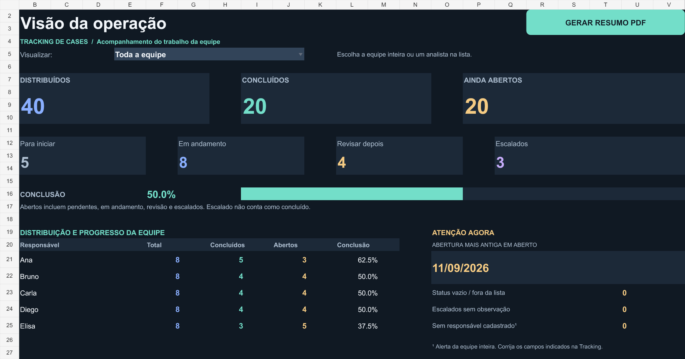

# Tracking operacional de cases

Ferramenta local em Python para distribuir uma base exportada do Creatio e acompanhar o trabalho da equipe em Excel. Os cases entram em ordem de abertura, do mais antigo para o mais recente, e recebem responsáveis de forma equilibrada.

O Creatio continua sendo o sistema oficial de atendimento. A versão 3 trabalha com arquivos e preenchimento manual da tracking. Não acessa APIs, não executa resgates e não altera os atendimentos no Creatio.



*Demonstração com 40 cases fictícios. Os números da imagem não representam resultados da operação.*

## Documentação

- [Guia passo a passo em Word](docs/Guia_Tracking_Cases.docx)
- [Apresentação da ferramenta](docs/Apresentacao_Tracking_Cases.pptx)

## O que a versão atual faz

- Importa `.xlsx` com colunas adicionais e utiliza apenas o número do case e as datas de abertura e modificação.
- Exclui os números cadastrados em uma lista local de cases em aguardo de chamado.
- Ordena por data e hora de abertura e alterna continuamente os responsáveis.
- Gera uma planilha `.xlsm` com as abas **Gestor**, **Tracking** e **Resumo**.
- Atualiza os indicadores do gestor por fórmulas quando a Tracking muda.
- Gera e abre um PDF pelo botão da aba Gestor no Excel instalado.
- Atualiza uma tracking da versão 2 em uma nova cópia, preservando os dados preenchidos.

## Requisitos

| Uso | Requisito |
| --- | --- |
| Distribuir ou atualizar o painel | Windows e Python 3.10 ou mais recente disponível no computador |
| Acompanhar as fórmulas | Excel 2019 ou mais recente, ou Microsoft 365 compatível |
| Usar o botão de PDF | Excel instalado e execução das macros permitida pela empresa |
| Trabalhar em equipe | Mesmo arquivo no SharePoint Online ou OneDrive, com edição e coautoria disponíveis |

As bibliotecas Python acompanham o programa em `Programa/bibliotecas`. A execução não instala pacotes, não usa rede e não solicita administrador. Python e Excel precisam estar disponíveis previamente. A alternativa de PDF em Python usa as fontes Arial presentes no Windows.

## Início rápido

1. Baixe e extraia a pasta completa do projeto.
2. Exporte a base do Creatio em `.xlsx` e salve-a em uma pasta local.
3. Edite `Programa/Cases_nao_distribuir.txt`: informe os cases em aguardo de chamado, um número por linha. **A cópia para publicação vem vazia.**
4. Abra `Programa/Iniciar.bat`.
5. Cole o caminho completo da base, por exemplo `C:\Bases\casos_do_dia.xlsx`.
6. Informe a quantidade de pessoas e o nome de cada uma, na ordem desejada.
7. Confira o resultado informado e abra o arquivo em `Programa/Saidas/<execucao>/Resgate_DD-MM.xlsm`.
8. Confira a aba **Resumo** e comece a atualizar a **Tracking**.

Cada execução cria sua própria pasta. Uma nova distribuição começa com todos os status como **Pendente**. Para acompanhar um lote que já começou, continue usando sua tracking existente.

## Teste com dados fictícios

A pasta `exemplos` contém uma [base criada do zero](exemplos/Base_Ficticia_Creatio.xlsx), com 42 cases numéricos, datas fora de ordem e colunas adicionais. Nenhum registro veio de uma exportação real. Consulte o [roteiro de teste](exemplos/COMO_TESTAR.md).

Com cinco nomes e a lista `exemplos/exclusoes_demo.txt`, o resultado esperado é: **42 recebidos, 2 excluídos e 40 distribuídos, 8 por pessoa**. Um terceiro número da lista é propositalmente ausente para testar o aviso. A distribuição começa com 40 pendentes. As imagens da documentação simulam uma etapa posterior do dia, com status preenchidos manualmente.

```powershell
python Programa/distribuir_cases.py "exemplos/Base_Ficticia_Creatio.xlsx" --analistas "Ana" "Bruno" "Carla" "Diego" "Elisa" --exclusoes "exemplos/exclusoes_demo.txt" --sem-pausa
```

## Formato da base

| Informação | Cabeçalhos reconhecidos |
| --- | --- |
| Número do case | `CASE` ou `Número do caso` |
| Abertura | `DATA DE ABERTURA` |
| Modificação | `DATA DE MODIFICAÇÃO` ou `Modificado em` |

O programa normaliza caixa, espaços e acentos dos cabeçalhos. Os cases devem conter apenas números. Mantenha-os como texto no Excel quando houver zeros à esquerda. Preserve as datas válidas da exportação. Se houver mais de uma aba compatível, selecione a aba solicitada ou use `--aba`.

Colunas adicionais ficam fora da tracking. As sete colunas de saída são:

```text
CASE | DATA DE ABERTURA | DATA DE MODIFICAÇÃO | STATUS | MOTIVO | OBSERVAÇÃO | RESPONSÁVEL
```

`DATA DE MODIFICAÇÃO` é a data importada do Creatio, não a hora em que alguém editou a tracking.

## Regra de distribuição

Após remover as exclusões, o programa ordena todos os cases por data e hora de abertura. O primeiro vai para a primeira pessoa, o segundo para a segunda, e assim por diante. Ao chegar ao último nome, a alternância recomeça. A alternância continua mesmo quando a data muda.

A diferença inicial entre as quantidades é de no máximo um case. Em empates de abertura, a ordem original da exportação é mantida. A regra equilibra **quantidade**, não complexidade ou tempo de trabalho. Nesta versão não há equipes separadas por faixas de datas.

## Como usar durante o dia

### Analista

Na aba **Tracking**, filtre `RESPONSÁVEL` pelo seu nome e mantenha a ordem crescente de abertura. Atualize `STATUS`, `MOTIVO` e `OBSERVAÇÃO`. O filtro facilita a visualização, mas não restringe o acesso aos registros das outras pessoas.

| Status | Significado |
| --- | --- |
| Pendente | Ainda não iniciado |
| Em andamento | Case em tratamento |
| Concluído | Tratamento finalizado |
| Revisar depois | Continua aberto com o mesmo responsável para retomada |
| Escalado | Continua aberto e aguarda apoio ou retorno |

Ao escalar, registre o destino e o contexto em `OBSERVAÇÃO`, por exemplo: `Escalado para: Equipe Financeira - aguardando retorno.` A mudança de status registra o escalonamento no tracking. Ela não envia mensagem nem transfere o case no Creatio.

### Gestor

Na aba **Gestor**, escolha `Toda a equipe` ou um nome no campo **Visualizar**. O filtro altera os indicadores e alertas do analista. A tabela de distribuição continua mostrando toda a equipe.

O painel exibe distribuídos, concluídos, ainda abertos, pendentes, em andamento, para revisão, escalados, percentual de conclusão e a data da abertura mais antiga ainda em aberto. Os alertas ajudam a encontrar status vazios ou fora da lista, escalados sem observação e responsáveis não cadastrados. O último alerta sempre considera a equipe inteira.

**Ainda abertos = distribuídos − concluídos.** Revisões e escalonamentos já fazem parte dos abertos. A aba **Resumo** preserva a distribuição inicial e a conferência das exclusões. Ela não é o painel de status atual.

### PDF com um clique

1. Abra a planilha no Excel instalado, com as macros permitidas no ambiente da empresa.
2. Na aba Gestor, selecione a equipe ou o analista.
3. Clique em **GERAR RESUMO PDF**.
4. O Excel recalcula a visão atual, salva e abre o PDF.

Os arquivos ficam em `Relatorios_PDF`, ao lado da planilha, com data e hora no nome. Se o Excel abrir a planilha por um endereço web do SharePoint, o destino usado pelo botão é `Documents/Relatorios_PDF` na pasta do usuário do Windows. O PDF reflete os dados do arquivo aberto, inclusive edições ainda não salvas, e o filtro escolhido.

O [Excel no navegador não executa VBA](https://support.microsoft.com/en-us/excel/work-with-vba-macros-in-excel-for-the-web). Preserve o formato `.xlsm` para manter o botão. Se houver bloqueio corporativo de macros, siga a orientação da TI. Não é necessário alterar a segurança do Excel para usar as fórmulas do painel.

Como alternativa, `Programa/Gerar_PDF.bat` lê uma planilha `.xlsx` ou `.xlsm` salva e gera um relatório de todos os registros. Essa alternativa não considera o filtro visual do gestor.

## Uso compartilhado

O programa gera um arquivo local. Para acompanhamento da equipe, coloque a tracking em uma biblioteca autorizada do SharePoint Online ou OneDrive e compartilhe o **mesmo arquivo**, com permissão de edição e coautoria. Confirme a sincronização antes de emitir o relatório. Cópias locais e anexos separados não se atualizam entre si.

A configuração do ambiente fica a cargo da empresa. A ferramenta não publica arquivos, não faz login e não configura permissões. Consulte os [requisitos de coautoria da Microsoft](https://support.microsoft.com/pt-br/excel/get-started/collaborate-on-excel-workbooks-at-the-same-time-with-co-authoring).

## Atualizar um arquivo da versão 2

Abra `Programa/Atualizar_Painel.bat` e cole o caminho do `.xlsx` da versão 2. O programa cria outra cópia em `.xlsm`, preservando a Tracking, a equipe e o Resumo original. Confira a nova cópia antes de adotá-la. Esse procedimento não redistribui os cases.

## Uso pela linha de comando

Execute a partir da raiz deste projeto, com Python disponível:

```powershell
python Programa/distribuir_cases.py "C:\Bases\casos_do_dia.xlsx" --analistas "Ana" "Bruno" "Carla" --aba "Caso" --sem-pausa
```

Os parâmetros `--saida` e `--exclusoes` aceitam caminhos para outra pasta de saída e outra lista de exclusões. Use `python Programa/distribuir_cases.py --help` para consultar as opções. Caminhos e nomes com espaços devem ficar entre aspas.

## Estrutura

```text
README.md
.gitignore
docs/
  Guia_Tracking_Cases.docx
  Apresentacao_Tracking_Cases.pptx
  imagens/painel_gestor.png
  imagens/tracking.png
exemplos/
  Base_Ficticia_Creatio.xlsx
  exclusoes_demo.txt
  COMO_TESTAR.md
Programa/
  Iniciar.bat
  Atualizar_Painel.bat
  Gerar_PDF.bat
  distribuir_cases.py
  painel_gestor.py
  dashboard_gestor.py
  atualizar_painel.py
  gerar_relatorio.py
  incluir_botao_pdf.py
  Cases_nao_distribuir.txt
  bibliotecas/
  recursos/
```

Mantenha `bibliotecas` e `recursos` junto dos scripts. O código VBA do botão está em `Programa/recursos/RelatorioGestor.bas`; o projeto compilado está em `vbaProject.bin`. Editar o `.bas` isoladamente não atualiza o binário já incorporado às planilhas.

## Problemas comuns

| Situação | O que conferir |
| --- | --- |
| Python não encontrado | Disponibilidade de Python 3.10+ autorizado no computador |
| Bibliotecas ou recursos ausentes | Extração completa do pacote, com todas as subpastas |
| Cabeçalhos não reconhecidos | Aba e nomes dos três campos de entrada |
| Painel não atualiza | Fórmulas > Opções de Cálculo > Automático e sincronização do arquivo compartilhado |
| PDF não sai pelo botão | Excel instalado, macros permitidas e pasta de destino com escrita |
| Contagem parece incorreta | Status fora da lista, filtro selecionado e alerta de responsáveis não cadastrados |

## Limites e possíveis evoluções

A versão atual não tem login por analista, controle de acesso por linha, registro automático de início e pausa, cálculo de tempo de tratamento, sincronização com o Creatio ou execução agendada. O preenchimento da Tracking alimenta os indicadores.

Uma próxima etapa, sujeita à análise da TI e à disponibilidade e autorização das APIs, pode incluir leitura automática da base, execução às 6h de segunda a sexta e regras para equipes que tratem diferentes faixas de abertura. Essas funções ainda não estão implementadas. Benefícios de tempo e produtividade devem ser medidos em um piloto.

## Arquivos da operação

Esta pasta para publicação contém o programa, a documentação, imagens de demonstração e uma base inteiramente fictícia. A lista operacional de exclusões está vazia; a lista da pasta `exemplos` contém apenas números fictícios. Mantenha bases, resultados, relatórios e listas reais fora do repositório. O `.gitignore` ajuda a excluir resultados, mas não remove dados já adicionados ao histórico. Antes de publicar, confira também o conteúdo de `Cases_nao_distribuir.txt` se ele tiver sido editado localmente.
